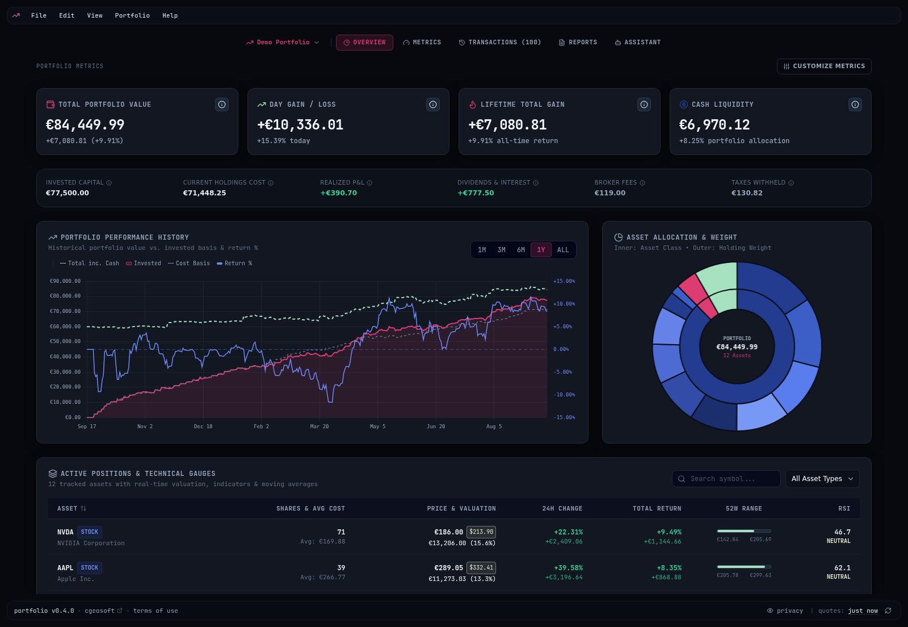

# Portfolio

An offline-first, private personal investment portfolio tracker for Linux (Debian) built with **Electrobun**, **Bun:SQLite**, and **React 19**.

Your portfolio data stays strictly on your local device. Market quotes are fetched live from Yahoo Finance, and AI analytical briefings can be generated on-demand using local (Ollama, llamacpp-server) or cloud (Groq, OpenAI, Anthropic, Gemini, OpenRouter, DeepSeek) LLMs.

<p align="center">
  
</p>

<p align="center">
  <sub>The overview dashboard on the built-in demo portfolio &mdash; customizable metric cards, performance history against invested capital, asset allocation by class and weight, and live positions with technical gauges.</sub>
</p>

---

## Key Features

- **100% Offline-First Data Storage**: Portfolios, transactions, and snapshots are stored locally in SQLite (`~/.config/portfolio/data/portfolio.sqlite`). No external server or accounts needed.
- **Local SQLite Engine (`bun:sqlite`)**: High-performance WAL-mode SQLite database with indexed tables and instant queries.
- **Live Market Valuation & Multi-Currency FX**: Real-time quotes, intraday P&L, historical charts, and foreign exchange conversions powered by Yahoo Finance.
- **Progressive Financial Analytics**: Automatic calculation of total invested capital, realized gains, uninvested cash liquidity balance, dividend income, broker fees, and tax withholdings.
- **Sandboxed Metric Modules**: Every metric is a WebAssembly module with a YAML manifest that declares its developer, version, and the data scopes it reads. Modules run in a separate engine process with no file, network, or system access, a memory ceiling, and a time budget. The Metrics tab lists the metrics of a portfolio, a bounded dashboard (4 large cards, 6 compact tiles) that feeds the Overview, and a marketplace built from [`extras/metrics/repository.yml`](extras/metrics/README.md). Third-party modules can be installed from a URL after a scope consent dialog and stay marked UNVERIFIED.
- **Technical Indicators**: 50-day and 200-day Simple Moving Averages (SMA 50, SMA 200), 14-day Relative Strength Index (RSI), and 52-week ranges.
- **Broker CSV Importer**: Intelligent CSV import wizard with automatic template detection (Trade Republic, Scalable Capital, Interactive Brokers, Degiro) with dry-run diff preview and duplicate protection.
- **On-Demand AI Analyst**: Generate tactical markdown portfolio performance briefings via local or cloud LLMs.
- **Setup Wizard**: 3-step onboarding wizard describing the application, offering an optional 100-transaction demo portfolio, and an opt-in anonymous telemetry toggle.
- **Anonymous Telemetry (Opt-in)**: Privacy-preserving telemetry using PostHog, completely optional (default off). No financial data, portfolio values, or personal identifiers are ever transmitted.
- **Tactical Cyberpunk UI**: Monospace `JetBrains Mono` typography, sleek dark mode palette, and interactive Chart.js visualizations.

---

## Project Structure

```
portfolio/
├── electrobun.config.ts        # Electrobun desktop application configuration
├── package.json               # Flat project dependencies and scripts
├── tsconfig.json              # Bun main process TypeScript configuration
├── src/
│   ├── bun/                   # Main Process (Bun runtime)
│   │   ├── config.ts          # ~/.config/portfolio/config.json configuration manager
│   │   ├── index.ts           # Bun entry point, RPC handlers, window management
│   │   ├── logger.ts          # Rotating file logger
│   │   ├── db/                # bun:sqlite native database layer
│   │   │   ├── database.ts    # Database connection & schema migration
│   │   │   ├── portfolio.repo.ts
│   │   │   ├── transaction.repo.ts
│   │   │   ├── report.repo.ts
│   │   │   └── snapshot.repo.ts
│   │   └── services/          # Core analytics & integration services
│   │       ├── portfolio.ts   # Core analytics engine (holdings, equity curves, math)
│   │       ├── portfolio-report.ts # LLM report generator
│   │       ├── demo-portfolio.ts   # 100-transaction demo portfolio generator
│   │       ├── yahoo-finance.ts    # Market quotes, FX rates, chart histories
│   │       ├── llm.ts              # 8-provider LLM interface
│   │       ├── telemetry.ts        # PostHog anonymous analytics client
│   │       └── metrics/            # Sandboxed metric modules: engine process, registry, installer
│   ├── shared/                # Shared contracts
│   │   ├── rpc-types.ts       # Type-safe RPC schema (PortfolioRPC)
│   │   ├── metrics.ts         # Per-portfolio metric selection and dashboard slots
│   │   ├── metric-abi.ts      # Guest ABI v1: payload layout and data scopes
│   │   ├── metric-manifest.ts # Manifest schema and validation
│   │   └── metric-output.ts   # Result schema and host-side formatting
│   ├── types/                 # Unified domain types
│   │   ├── portfolio.ts       # FinancialPortfolioData, Holding, Transaction, Report
│   │   └── electrobun.d.ts    # Electrobun type definitions
│   └── views/                 # Webview GUI (React 19, Chart.js, Tailwind CSS)
│       ├── index.html         # Webview HTML shell
│       ├── main.ts            # Electroview entrypoint & React DOM mounter
│       ├── style.css          # Compiled Tailwind CSS & theme bundle
│       ├── tsconfig.json      # Webview TypeScript configuration
│       └── src/
│           ├── input.css      # Source Tailwind CSS stylesheet
│           ├── App.tsx        # Dashboard application router
│           ├── rpc.ts         # Electroview RPC client bridge
│           └── components/    # Reusable cards, modals, and navigation views
├── extras/
│   ├── metrics/               # Metric module repository (manifests + AssemblyScript sources)
│   └── website/               # Marketing site, including the generated metrics catalog page
└── scripts/
    ├── build-deb.sh           # Debian (.deb) package builder
    ├── build-metrics.ts       # Compiles metric modules and embeds the bundled ones
    ├── build-metrics-site.ts  # Renders extras/website/metrics/index.html from the repository
    └── release.sh             # Release orchestrator script
```

---

## Development & Build

### Prerequisites

- [Bun](https://bun.sh) (v1.2+)
- Linux with WebKitGTK (`libwebkit2gtk-4.1-0` or `libwebkit2gtk-4.0-37`)
- `dpkg-deb` (for building `.deb` packages)

### Install Dependencies

```bash
bun install
```

### Typecheck

Typechecks both the Bun main process and the React webview:

```bash
bun run typecheck
```

### Run in Development

```bash
bun run dev
```

> Note: `bun run dev` automatically compiles the metric modules and Tailwind CSS before starting the application. To watch CSS changes continuously during styling work, run `bun run watch:css` in a separate terminal.

### Build Tailwind CSS

```bash
bun run build:css
```

### Build Metric Modules

Compiles every metric in `extras/metrics/` with AssemblyScript and embeds the bundled ones in `src/bun/services/metrics/builtin-modules.generated.ts` (generated, not committed). `typecheck`, `test`, `dev`, and `build` run it first.

```bash
bun run build:metrics          # incremental
bun run build:metrics -- --force
bun run build:metrics-site     # regenerate the website catalog page
```

See [`extras/metrics/README.md`](extras/metrics/README.md) to write and submit a metric.

### Build Desktop Application

```bash
bun run build
```

### Build Debian Package (.deb)

```bash
bun run release:deb
```

The resulting package will be placed in `dist/portfolio_<version>_<arch>.deb`.

Install on Debian/Ubuntu with:

```bash
sudo dpkg -i dist/portfolio_0.1.0_amd64.deb
```
